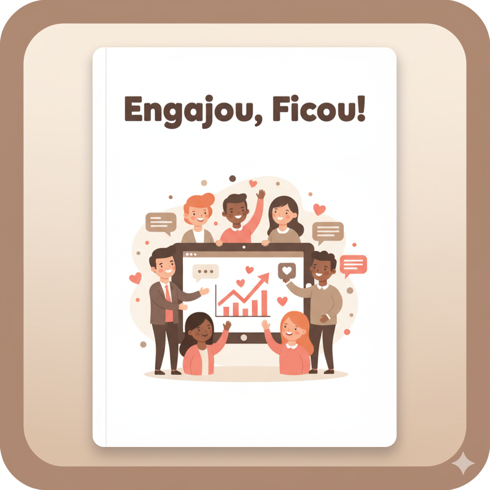

# Desafio EBOOK Gerado por I.A.s - DIO

## 💻 Tecnologias utilizadas no projeto

- [ChatGPT](https://chat.openai.com/) 
- [Gamma](https://gamma.app/)
- [Gemini](https://gemini.google/br/about/?hl=pt-BR)
- [PowerPoint](https://www.microsoft.com/en/microsoft-365/powerpoint)

## 🧠 Prompts

ChatGPT：

|   Ação   | prompt                                                                                                                                                                                                                                                                         |
| :------: | ------------------------------------------------------------------------------------------------------------------------------------------------------------------------------------------------------------------------------------------------------------------------------ |
|  título  | Crie um título de um ebook sobre o tema de Engajamento e Retenção, o ebook é do nicho de sucesso do cliente e o subnicho é de engajamento e retenção, o título deve ser divertido e amigável. me liste 5 variações de títulos                                                        |
| conteúdo | Faça um texto para ebook , com foco em Engajamento e retenção, listando as principais métricas usadas atualmente {REGRAS} Explique sempre de uma maneira simples Deixe o texto enxuto, Sempre traga exemplos em contextos reais , sempre deixe um título sugestivo por tópico |

Gemini：

|  Ação  | prompt                                                                                 |
| :----: | -------------------------------------------------------------------------------------- |
| título |  Crie uma capa ilustrada e divertida para um eBook com o título “Engajou, Ficou!”. A arte deve ter estilo cartoon, leve e colorido, transmitindo alegria, parceria e conexão entre empresa e cliente. Mostre pessoas felizes interagindo com um produto digital, gráficos de crescimento, ícones de chat e corações, representando relacionamento e fidelização.Use cores vibrantes, especialmente  marrom, bege e rosa, com fundo limpo e visual moderno. O estilo deve ser profissional e amigável, equilibrando elementos de negócios com um toque criativo.|

## ✨ Como foi realizado? 

- Conteúdo gerado via ChatGPT
- Imagem geradas via Gemini
- Apresentação gerada via Gamma

## Veja o resultado completo do Ebook:

## 👨‍💻 Expert

    
    
&nbsp&nbsp&nbsp Bianca Terra 
    &nbsp&nbsp&nbsp
    <a href="https://github.com/biancaterra93">
    GitHub</a>&nbsp;|&nbsp;
    <a href="https://www.linkedin.com/in/bianca-terra/">LinkedIn</a>

  
